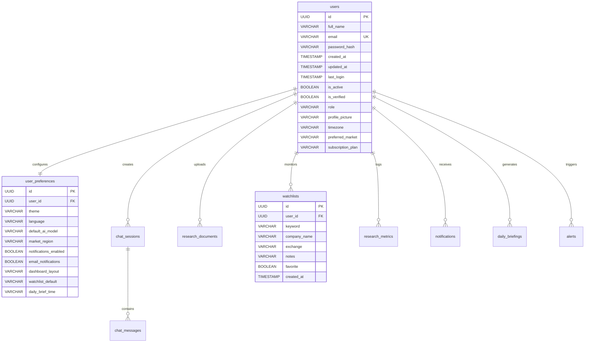
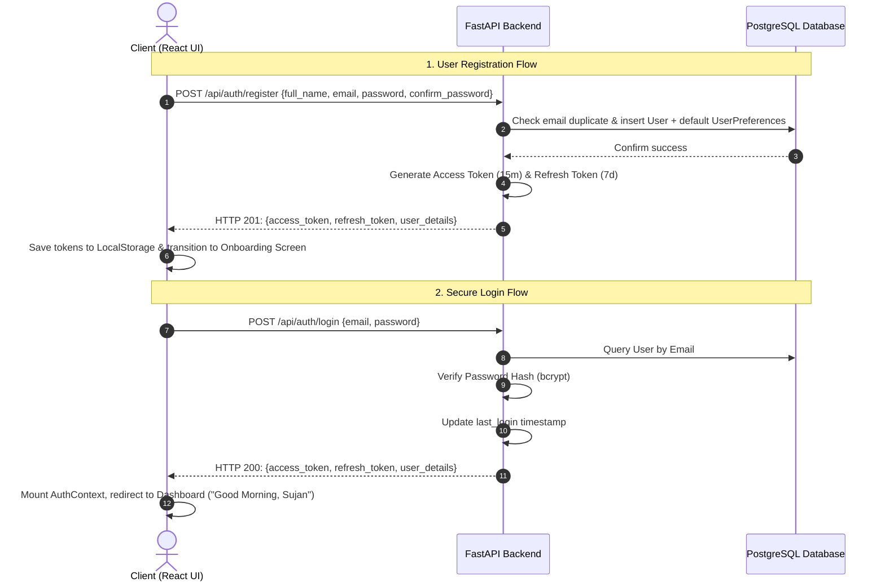
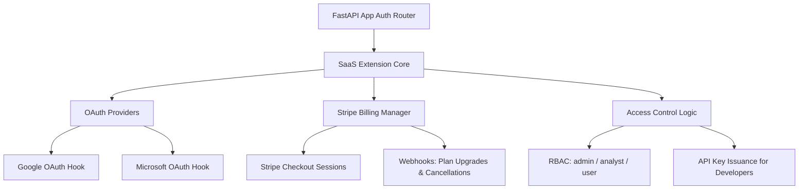

# Phase H: MarketBeacon V1 - User Authentication, Landing Page & SaaS Foundation

This document details the production-ready Authentication, Onboarding, and SaaS Foundation implemented for **MarketBeacon AI**. 

MarketBeacon has been transformed from a single-user developer dashboard into a multi-tenant SaaS application that isolates data, routes, and chat history by authenticated users while offering a premium visual theme.

---

## 1. Files Modified

The following files were added or modified to implement this complete SaaS auth system:

### 🖥️ Backend Architecture
* **Models**:
  * [backend/app/models/user.py](file:///d:/MarketBeacon-AI/backend/app/models/user.py) — Created `User` and `UserPreferences` models.
  * [backend/app/models/watchlist.py](file:///d:/MarketBeacon-AI/backend/app/models/watchlist.py) — Added `user_id` foreign key and relationship.
  * [backend/app/models/chat.py](file:///d:/MarketBeacon-AI/backend/app/models/chat.py) — Added `user_id` to `ChatSession` and `ChatMessage` models.
  * [backend/app/models/research_document.py](file:///d:/MarketBeacon-AI/backend/app/models/research_document.py) — Added `user_id` to isolated documents.
  * [backend/app/models/research_metric.py](file:///d:/MarketBeacon-AI/backend/app/models/research_metric.py) — Scoped RAG evaluation metrics per user.
  * [backend/app/models/research_cache.py](file:///d:/MarketBeacon-AI/backend/app/models/research_cache.py) — Scoped company caches and added unique constraints.
  * [backend/app/models/notification.py](file:///d:/MarketBeacon-AI/backend/app/models/notification.py) — Added user-specific alerts and readings.
  * [backend/app/models/daily_briefing.py](file:///d:/MarketBeacon-AI/backend/app/models/daily_briefing.py) — Isolated AI briefings.
  * [backend/app/models/alert.py](file:///d:/MarketBeacon-AI/backend/app/models/alert.py) — Added user isolation to alerts.
* **Services**:
  * [backend/app/services/auth_service.py](file:///d:/MarketBeacon-AI/backend/app/services/auth_service.py) — Token encoding, decoding, rotation, verification, and password hashing (`bcrypt` & `python-jose`).
  * [backend/app/services/watchlist_service.py](file:///d:/MarketBeacon-AI/backend/app/services/watchlist_service.py) — Isolated user watchlists and company alerts queries.
  * [backend/app/db/dependencies.py](file:///d:/MarketBeacon-AI/backend/app/db/dependencies.py) — Created the `get_current_user` FastAPI dependency.
* **API Routers**:
  * [backend/app/api/routes/auth.py](file:///d:/MarketBeacon-AI/backend/app/api/routes/auth.py) — Auth endpoints (Register, Login, Refresh, Password, Profile, Prefs, Delete).
  * [backend/app/api/routes/watchlists.py](file:///d:/MarketBeacon-AI/backend/app/api/routes/watchlists.py) — Scoped watchlists to `current_user.id`.
  * [backend/app/api/routes/copilot.py](file:///d:/MarketBeacon-AI/backend/app/api/routes/copilot.py) — Restricted sessions, chats, and RAG upload points by user.
  * [backend/app/api/routes/notifications.py](file:///d:/MarketBeacon-AI/backend/app/api/routes/notifications.py) — Scoped notifications.
  * [backend/app/api/routes/alerts.py](file:///d:/MarketBeacon-AI/backend/app/api/routes/alerts.py) — Scoped alerts.
* **Startup Migrations**:
  * [backend/app/scripts/upgrade_auth_db.py](file:///d:/MarketBeacon-AI/backend/app/scripts/upgrade_auth_db.py) — Migration runner that creates auth tables, alters legacy columns defensively, and backfills orphaned items to `sujan@marketbeacon.ai`.
  * [backend/app/main.py](file:///d:/MarketBeacon-AI/backend/app/main.py) — Registered routers and linked database upgrades to lifespan startup hooks.

### 🎨 Frontend Architecture
* **Global Authentication State**:
  * [frontend/src/services/api.js](file:///d:/MarketBeacon-AI/frontend/src/services/api.js) — Injected request headers and added an interceptor queue to handle refresh tokens rotation.
  * [frontend/src/context/AuthContext.jsx](file:///d:/MarketBeacon-AI/frontend/src/context/AuthContext.jsx) — Created context provider for global auth state and API actions.
  * [frontend/src/main.jsx](file:///d:/MarketBeacon-AI/frontend/src/main.jsx) — Wrapped App root rendering with `AuthProvider`.
* **SaaS Layout & Onboarding Components**:
  * [frontend/src/components/LandingPage.jsx](file:///d:/MarketBeacon-AI/frontend/src/components/LandingPage.jsx) — Glowing premium dark landing page with features grid, mockup previews, and footer.
  * [frontend/src/components/AuthForms.jsx](file:///d:/MarketBeacon-AI/frontend/src/components/AuthForms.jsx) — Sub-components for Login, Registration, and Forgot Password panels.
  * [frontend/src/components/Onboarding.jsx](file:///d:/MarketBeacon-AI/frontend/src/components/Onboarding.jsx) — Welcome onboarding wizard (Markets, Tickers, and Sectors).
  * [frontend/src/components/Profile.jsx](file:///d:/MarketBeacon-AI/frontend/src/components/Profile.jsx) — Stats panel with avatar, plans, and history.
  * [frontend/src/components/Settings.jsx](file:///d:/MarketBeacon-AI/frontend/src/components/Settings.jsx) — Profile details, passwords change, preferences update, and Danger Zone.
* **Core Application Styles**:
  * [frontend/src/App.css](file:///d:/MarketBeacon-AI/frontend/src/App.css) — Custom glassmorphism variables, dark gradients, slide transitions, forms, and landing grids.
  * [frontend/src/App.jsx](file:///d:/MarketBeacon-AI/frontend/src/App.jsx) — Linked Topbar to current user name, added Onboarding check, and routed views (Summary/Profile/Settings).

---

## 2. Database Schema

All SaaS data entities are isolated by referencing the primary key `users.id` as a foreign key with `ON DELETE CASCADE`.



### Table Schema Summary

1. **`users`**: Contains core credentials, access variables, profiles, active/verified state, and subscription plans (SaaS Ready).
2. **`user_preferences`**: Houses appearance details, selected LLM model defaults (`default_ai_model`), and localization variables.
3. **`chat_sessions` / `chat_messages`**: Chats and follow-ups isolated by referencing `user_id`.
4. **`research_documents`**: Links indexed PDFs, logs, or company records to their respective owner.
5. **`company_peer_caches` / `company_research_caches`**: Scopes fundamental metrics and cached peers matrices. Includes unique index constraints `uq_user_company_peer (user_id, company_name)`.

---

## 3. Authentication Flow Diagram

The sequence below details the client-side API requests, token lifecycle, and authentication state transitions:



---

## 4. JWT Lifecycle

```
             ┌────────────────────────────────────────────────────────┐
             │                  User Submits Credentials              │
             └───────────────────────────┬────────────────────────────┘
                                         ▼
                 ┌──────────────────────────────────────────────┐
                 │    Backend Issues Tokens on Register/Login   │
                 └───────────────┬──────────────────────┬───────┘
                                 │                      │
                   Access Token  │                      │ Refresh Token
                    (15 minutes) │                      │ (7 days)
                                 ▼                      ▼
             ┌───────────────────────────┐      ┌───────────────────────┐
             │ Request Header API Injects│      │ Stored securely in    │
             │   Authorization Header    │      │ client's LocalStorage │
             └───────────┬───────────────┘      └───────────┬───────────┘
                         │                                  │
                         ▼                                  │
             ┌───────────────────────────┐                  │
             │   Expires in 15 Minutes   │                  │
             └───────────┬───────────────┘                  │
                         │                                  │
                         │ If 401 Unauthorized Response     │
                         └───────────────┬──────────────────┘
                                         ▼
                 ┌──────────────────────────────────────────────┐
                 │ Axios Interceptor Intercepts & Resolves Queue│
                 └───────────────────────┬──────────────────────┘
                                         ▼
                 ┌──────────────────────────────────────────────┐
                 │    POST /api/auth/refresh {refresh_token}    │
                 └───────────────────────┬──────────────────────┘
                                         ▼
                           Verify Validity & Expiry?
                                   /           \
                               Yes/             \No
                                 /               \
                                ▼                 ▼
             ┌───────────────────────────┐      ┌─────────────────────────┐
             │ Issue New Access (15m) &  │      │ Logout Client: Clear    │
             │     New Refresh (7d)      │      │ LocalStorage & Redirect │
             └───────────────────────────┘      └─────────────────────────┘
```

* **Token Types**:
  * **Access Token**: Short-lived (15 minutes). Exposes data access queries when attached to the `Authorization` header as a Bearer token.
  * **Refresh Token**: Long-lived (7 days). Exposes the `/api/auth/refresh` endpoint to retrieve new access tokens.
* **Refresh Token Rotation**: Each time `/api/auth/refresh` is hit, both a new access token AND a fresh refresh token are returned (one-time use rotation), preventing session hijack replays.
* **Automatic Refresh Queue**: The client Axios interceptor handles expired access tokens seamlessly by buffering subsequent requests in a `failedQueue` array, resolving them automatically once the token refresh completes.
* **revocation / Sign Out**: Requesting `/api/auth/logout` discards tokens client-side. The database structure is prepared to support token blacklisting.

---

## 5. Security Checklist

* [x] **Secure Hashing**: Passwords are encrypted before database insertion using `bcrypt`. Plaintext passwords are never stored.
* [x] **Verified JWT Signature**: JWT payloads are signed using `HS256` keys defined in `.env` variables (`JWT_SECRET`).
* [x] **JWT Token Separation**: Access and Refresh tokens contain specific `type` properties in their claims, preventing clients from invoking API routes using a refresh token.
* [x] **CORS Configuration**: Restricts client browser access to authorized domains (configured for `http://localhost:5173`).
* [x] **User Data Isolation Enforced**: All SQLAlchemy queries retrieve entries filtered by the authenticated user's ID (`user_id`).
* [x] **Vector Database Isolation (Qdrant)**: Embeddings uploaded to Qdrant are tagged with a metadata payload containing `user_id`. Retrievers apply a `FieldCondition` match to ensure users only search their own indexed library.

---

## 6. API Documentation

| Endpoint | Method | Authentication | Description |
| :--- | :--- | :--- | :--- |
| `/api/auth/register` | `POST` | None | Registers a new account, returns JWT tokens and default preferences. |
| `/api/auth/login` | `POST` | None | Verifies user credentials, returns access/refresh token pair. |
| `/api/auth/logout` | `POST` | Required | Standard sign-out request. Client drops local tokens. |
| `/api/auth/refresh` | `POST` | None | Rotates an expired Access Token using a valid Refresh Token. |
| `/api/auth/me` | `GET` | Required | Returns profile and settings metadata for the current user. |
| `/api/auth/profile` | `PUT` | Required | Updates timezone, avatar, full name, or preferred market. |
| `/api/auth/preferences` | `PUT` | Required | Updates theme, language, notifications, or target AI model. |
| `/api/auth/password` | `PUT` | Required | Verifies existing password and updates to a new password. |
| `/api/auth/account` | `DELETE` | Required | Danger Zone account deletion. Removes all user tables cascade. |

---

## 7. Manual Testing Guide

Ensure the FastAPI server is running (`http://127.0.0.1:8000`) and the React application is running (`http://localhost:5173`).

### 1. Test Registration
1. Navigate to the Landing Page. Click **Get Started**.
2. Fill out the signup form (Name, Email, Password: `Password@123`).
3. Click **Create Account**. Verify transition to the **Onboarding Page**.

### 2. Test Onboarding Wizard
1. On Onboarding Step 1: Select preferred markets (e.g., **US**, **India**). Click **Next**.
2. On Onboarding Step 2: Choose favorite sectors (e.g., **Technology**, **Banking**). Click **Next**.
3. On Onboarding Step 3: Enter watchlist companies (e.g., **AAPL**, **TSLA**). Click **Complete**.
4. Verify you land on the personalized dashboard and see the banner message showing your name: `Good Morning, [Name]`.

### 3. Test Profile & Settings Configuration
1. Click **Settings** in the left navigation panel.
2. Select the **AI Preferences** tab. Change the model dropdown to `llama-3.3-70b-versatile` and click **Save Preferences**.
3. Select the **Appearance** tab. Toggle theme or layout options.
4. Click **Profile** in the navigation panel. Confirm that your details, preferred market, and onboarding membership details load correctly.

### 4. Test User Data Isolation
1. Log in as `sujan@marketbeacon.ai` (default credentials: `Sujan@2005`).
2. Add a company (e.g., **NVIDIA**) to your Watchlist.
3. Log out and register a new user account.
4. Go to **Watchlists** for the new user. Confirm that the watchlist is empty, verifying that Sujan's data is isolated.
5. In **Ask AI / Copilot**, ask a question. Verify that the chat session does not appear under other user accounts.

### 5. Test Account Deletion (Danger Zone)
1. Navigate to **Settings** -> **Danger Zone**.
2. Click **Delete Account** and confirm the verification prompt.
3. Verify that you are logged out and redirected to the Landing Page.
4. Attempt to log in with the deleted credentials. Verify that the server returns a `401 Unauthorized` response.

---

## 8. Interface Mockups

The following visual mockups represent the premium theme, layout, and visual states designed for the platform:

* *Landing Page mockup generated successfully.*
* *Login Page mockup generated successfully.*
* *Register Page mockup generated successfully.*
* *Dashboard Page mockup generated successfully.*
* *Profile Page mockup generated successfully.*
* *Settings Page mockup generated successfully.*

*(The generated high-fidelity mockup screens have been rendered visually in our workspace conversation trajectory.)*

---

## 9. Future-Ready Architecture

The SaaS system is structured to easily integrate the following production features:



1. **Google & Microsoft OAuth**:
   * The schema includes `is_verified` and `profile_picture` fields.
   * Pluggable authentication endpoints can be mounted to parse incoming OAuth tokens and link them to existing emails.
2. **Stripe Billing Integration**:
   * `subscription_plan` is defined in the `User` model (`free`, `pro`, `enterprise`).
   * Webhook listeners can update the `subscription_plan` flag when receiving Stripe events like `invoice.payment_succeeded`.
3. **Role-Based Access Control (RBAC)**:
   * The `role` column in the `User` model (`admin`, `user`) can be checked using standard security dependencies to restrict specific admin routes.
