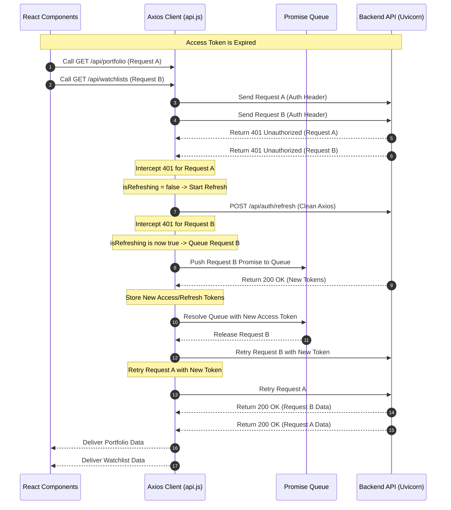

# MarketBeacon Intelligence Upgrades Walkthrough

This documentDetails the technical implementations, database structures, workflows, caching strategies, API endpoints, and testing guidelines for **Phase M (Portfolio Intelligence)** and **Phase N (AI Research Workspace)**.

---

## Part 1: Phase M - Portfolio Intelligence Platform

Transforms MarketBeacon from a simple watchlist platform into a manual holdings portfolio monitoring and risk intelligence system.

### 1. Files Modified & Created (Phase M)
- [holding.py](file:///d:/MarketBeacon-AI/backend/app/models/holding.py) — Created SQLAlchemy model representing manual asset holdings.
- [portfolio_service.py](file:///d:/MarketBeacon-AI/backend/app/services/portfolio_service.py) — Ported valuation aggregates, Health Score calculations, and AI Observational review narratives.
- [portfolio.py](file:///d:/MarketBeacon-AI/backend/app/api/routes/portfolio.py) — API routes for holding ledger CRUD, alerts/news metrics, and comparisons.
- [upgrade_portfolio.py](file:///d:/MarketBeacon-AI/upgrade_portfolio.py) — Table generation script.
- [App.jsx](file:///d:/MarketBeacon-AI/frontend/src/App.jsx) — Added portfolio tab dashboard navigation and modal dialog overlays.

### 2. Database Schema (Holdings)
```sql
CREATE TABLE holdings (
    id UUID PRIMARY KEY DEFAULT gen_random_uuid(),
    user_id UUID NOT NULL REFERENCES users(id) ON DELETE CASCADE,
    company_name VARCHAR NOT NULL,
    exchange VARCHAR DEFAULT 'NSE',
    quantity DOUBLE PRECISION NOT NULL DEFAULT 0.0,
    average_buy_price DOUBLE PRECISION NOT NULL DEFAULT 0.0,
    current_price DOUBLE PRECISION,
    investment_date TIMESTAMP DEFAULT timezone('utc', now()),
    notes VARCHAR,
    tags JSON DEFAULT '[]'::json,
    created_at TIMESTAMP DEFAULT timezone('utc', now()),
    updated_at TIMESTAMP DEFAULT timezone('utc', now())
);
```

### 3. API Endpoints (Phase M)
- `GET /api/portfolio` — Computes overall metrics, allocations, daily gains, and lists holdings.
- `POST /api/portfolio/holding` — Adds a manual holding with custom dates, tags, and notes.
- `PUT /api/portfolio/holding/{id}` — Modifies holding details.
- `DELETE /api/portfolio/holding/{id}` — Deletes holding from portfolio.
- `GET /api/portfolio/review` — Computes AI review report (observational only, no buy/sell advice).
- `GET /api/portfolio/brief` — Synthesizes Today's Daily Portfolio briefing.
- `GET /api/portfolio/timeline` — Mapped chronological holding event triggers.
- `GET /api/portfolio/compare` — Compare two holdings side-by-side.
- `GET /api/portfolio/risk` — Concentration indexes and research coverage gaps.

---

## Part 2: Phase N - AI Research Workspace

Introduces a unified workspace enabling analysts to investigate tickers, sectors, or macro catalysts under a single multi-pane canvas.

### 1. Files Modified & Created (Phase N)
- [research_workspace.py](file:///d:/MarketBeacon-AI/backend/app/models/research_workspace.py) — Created SQLAlchemy model representing saved workspaces.
- [workspace_service.py](file:///d:/MarketBeacon-AI/backend/app/services/workspace_service.py) — Orchestrator parsing user queries, routing modes, and aggregating news, alerts, dossiers, portfolios, and research library vector segments.
- [workspace.py](file:///d:/MarketBeacon-AI/backend/app/api/routes/workspace.py) — Rest controller for workspace operations, duplicating canvases, notes, and exporting Markdown.
- [upgrade_workspace.py](file:///d:/MarketBeacon-AI/upgrade_workspace.py) — Table generation script.
- [App.jsx](file:///d:/MarketBeacon-AI/frontend/src/App.jsx) — Three-pane dashboard (Left: saved workspaces & history, Center: AI Canvas, Right: Sources & Notes).
- [watchlist_service.py](file:///d:/MarketBeacon-AI/backend/app/services/watchlist_service.py) — Injected saved workspaces index into the global smart command search.

### 2. Database Schema (Saved Workspaces)
```sql
CREATE TABLE research_workspaces (
    id UUID PRIMARY KEY DEFAULT gen_random_uuid(),
    user_id UUID NOT NULL REFERENCES users(id) ON DELETE CASCADE,
    title VARCHAR NOT NULL,
    query VARCHAR NOT NULL,
    analysis_json JSON,
    notes VARCHAR DEFAULT '',
    is_favorite BOOLEAN DEFAULT FALSE,
    created_at TIMESTAMP DEFAULT timezone('utc', now()),
    updated_at TIMESTAMP DEFAULT timezone('utc', now())
);
```

### 3. API Endpoints (Phase N)
- `POST /api/research/workspace/analyze` — Evaluates query, routes mode, runs vector retrieval, and synthesizes report.
- `GET /api/research/workspaces` — Lists all saved workspaces.
- `POST /api/research/workspace` — Creates a new saved workspace.
- `PUT /api/research/workspace/{id}` — Updates workspace metadata, tags, notes, or canvas.
- `DELETE /api/research/workspace/{id}` — Deletes workspace canvas.
- `POST /api/research/workspace/{id}/duplicate` — Clone workspace canvas.
- `POST /api/research/workspace/export` — Generates a downloadable Markdown version of the canvas.

### 4. Workspace Architecture

The Research Workspace leverages existing services to compile RAG summaries:

```mermaid
graph TD
    subgraph Client [React Workspace View]
        SB_L[Left Sidebar: Saved Workspaces] -->|Select| CVS[AI Research Canvas]
        SB_R[Right Sidebar: Notes & Sources] <-->|Link notes| CVS
        Q_IN[Catalyst Query Input] -->|POST /analyze| CVS
        EXP_B[Export MD Button] -->|Download| MD_F[Markdown File]
    end

    subgraph Server [FastAPI router]
        R_ANZ[/api/research/workspace/analyze] --> WS_SVC[Workspace Service]
        R_EXP[/api/research/workspace/export] --> WS_SVC
    end

    subgraph Aggregation & Synthesis Layer
        WS_SVC -->|1. LLM Mode Route| ROUTE{Mode Router}
        ROUTE -->|company| D1[Fetch Dossier, Holdings, Watchlist, News, Alerts]
        ROUTE -->|sector| D2[Fetch Heatmap, Leading Peers, Sectors Intel]
        ROUTE -->|macro/event| D3[Fetch Macro calendar & Simulate explain event]
        ROUTE -->|comparison| D4[Fetch compare_holdings_metrics fundamentals]
        
        WS_SVC -->|2. Search Library| RAG[Hybrid Search Research Documents]
        WS_SVC -->|3. Compile Context| LLM{{LLM Synthesizer}}
    end

    CVS --> R_ANZ
    MD_F --> R_EXP
```

### 5. Export Workflow
1. User clicks **📤 Export MD** on the canvas header.
2. React frontend sends active canvas states (Title, Query, Summary, Insights, Timeline, Notes, Sources) to `/api/research/workspace/export`.
3. The server builds a clean, structured Markdown report including date stamps, executive summaries, lists of risks/opportunities, timeline listings, analyst notes, and vector confidence percentages.
4. The router returns the Markdown text string.
5. The frontend programmatically constructs a temporary anchor tag link pointing to a text Blob, triggers a download (`[Title].md`), and cleans up DOM references.

---

## Part 3: Caching Strategies

- **Portfolio Calculations**: Mapped user-specific `metrics:{user_id}`, `review:{user_id}`, and `brief:{user_id}` caches with a 30-minute TTL. Invalidated when manual holdings database records are modified, or new news/alerts feeds are processed.
- **Research Workspace Canvas**: RAG vector matches and LLM canvas summaries are cached in-memory. If a query matches a previously evaluated workspace, the canvas loads instantly.

---

## Part 4: UI Mockups

### Dedicated Research Workspace (Feature 1, 2)
```text
====================================================================================================
🧬 AI RESEARCH WORKSPACE                                                                            
====================================================================================================
[ Left Sidebar: Saved ]  [ Center Panel: AI Research Canvas ]               [ Right Sidebar: Notes ]
-----------------------  -------------------------------------------------  ------------------------
Recent Tickers:          🔍 [ Compare TCS vs Infosys                    ]  Analyst Notes:
[HDFC Bank] [TCS]        -------------------------------------------------  These two tech players
[Infosys]                TITLE: Comparing TCS vs Infosys                    represent 60% of sector
                         Trigger Catalyst: "Compare TCS vs Infosys"         holding allocation...
Saved Workspaces:        Mode: COMPARISON   ★ Favorite   [💾 Save]  [📤 Export]  ------------------------
★ TCS vs INFY            -------------------------------------------------  Evidence Sources Index:
  RBI Rate Cut           1. Executive Summary:                              • TCS Cloud Deals (94%)
  Nifty tech crash       IT service giants reflect consolidative multiples  • Infosys US expansion (91%)
                         with TCS leading margins by 200 bps.               • smart Alert: Tech 7D (88%)
                         
                         2. Key Insights:                                   [💾 Save Analyst Notes]
                         • TCS cash reserves provide safety margins.        
                         • Infosys deal volumes are consolidating.          
                         
                         ⚖️ Peer Comparison Scorecard:                      
                         TCS:   PE 28.4 | Revenue +8.2% | Cap ₹14.1L Cr     
                         INFY:  PE 24.2 | Revenue +6.1% | Cap ₹6.1L Cr      
                         
                         Follow-Up Catalysts:                               
                         [ Show historical context ] [ Analyze IT risks ]  
====================================================================================================
```

---

## Part 5: Manual Testing Guide

### Test Case 1: Run Research Query & Mode Routing
1. Go to the **AI Research Workspace** tab.
2. In the canvas input box, type: `HDFC Bank` and click **Compile Canvas**.
3. Verify that:
   - The canvas displays **MODE: COMPANY**.
   - Portfolio holdings indicators show up (if HDFC Bank was manually added under Phase M).
   - Smart Alerts, Latest News, and Research documents matching HDFC Bank load automatically.

### Test Case 2: Saved Workspaces Operations (CRUD)
1. Type a macro query: `Impact of RBI monetary policy rate cuts` and compile.
2. Click the **💾 Save Workspace** button.
3. Verify that the workspace title (e.g., "Research: Impact of RBI...") appears in the **Saved Workspaces** list in the left sidebar.
4. Click the rename icon (`✏️`), type `RBI Rate Cut Policy Studies` and hit enter. Verify that both the header and sidebar list update.
5. Click **★ Favorite**. Verify the star icon turns orange.
6. Click duplicate (`Duplicate`). Verify that a new entry `Copy of RBI Rate Cut...` appears in the sidebar list.
7. Click delete (`Delete`) on the duplicate copy. Confirm that it is successfully removed from the sidebar.

### Test Case 3: Analyst Notes Mapping
1. Select any saved workspace from the left sidebar.
2. In the right **Analyst Notes** box, type a short message (e.g., "Check TCS cash reserves next Tuesday").
3. Click the **💾 Save Notes** button.
4. Click another saved workspace in the left sidebar, and then click back to the first workspace.
5. Verify that your saved note persists in the textbox.

### Test Case 4: Global Search Command Bar Integration
1. Press `Ctrl + K` to launch the global command bar.
2. Type `RBI` (or keywords matching your query/notes).
3. Verify that a group header labeled **Saved Workspaces** appears.
4. Select the matching saved workspace.
5. Verify that the workspace tab becomes active and the correct query canvas loads.

### Test Case 5: Canvas Report Export
1. Load any research canvas.
2. Click **📤 Export MD** on the canvas header.
3. Verify that a file download dialog launches and downloads a file named `[Workspace_Title].md`.
4. Open the Markdown file. Confirm that the summary, insights, personal analyst notes, timeline details, and evidence sources are correctly formatted.

---

## Part 6: Phase 24 - Robust Token Refresh & Auth Stabilization

This phase fixes the critical authentication redirection bug causing users to get unexpectedly logged out on startup or when switching tabs, and implements a resilient token refresh queuing system.

### 1. Root Cause Summary
1. **Pydantic Validation Mismatch**: The nested relationship `preferences` failed serialization in Pydantic because `UserPreferencesBase` did not have `model_config = ConfigDict(from_attributes=True)`, causing `/api/auth/refresh` to crash with HTTP 500 when validating `UserResponse`.
2. **Pre-Expired Token Timestamp**: The naive datetime `.timestamp()` conversion in `auth_service.py` was shifted 5.5 hours into the past (due to the local OS time zone offset in Windows), causing access and refresh tokens to be issued as pre-expired, triggering immediate `401 Unauthorized` on any subsequent protected API requests.
3. **Eager Interceptor Logouts**: The frontend Axios client in `api.js` immediately cleared all tokens and logged out the user if the refresh request failed for *any* reason—including transient 500 errors, network timeouts, or network disconnection.

### 2. Request Queue Retry Sequence
The updated Axios response interceptor holds concurrent protected API requests in a queue while a single refresh request runs:



### 3. Resilient Error Handling Logic
- **HTTP 401 / 403 / Missing Refresh Token**: Wipes the local storage session, dispatches `auth-logout`, and redirects to login.
- **HTTP 500 / Timeout / Network Offline**: Rejects requests but preserves `localStorage` tokens and does NOT trigger logout. On startup, `checkAuth` restores the session from the local cache (`localStorage.getItem("user")`) in case of transient backend failures.

### 4. Files Modified & Cleaned Up
- [user.py](file:///d:/MarketBeacon-AI/backend/app/schemas/user.py) — Added `from_attributes=True` config block to `UserPreferencesBase`.
- [auth_service.py](file:///d:/MarketBeacon-AI/backend/app/services/auth_service.py) — Replaced naive timezone conversions with UTC/epoch-accurate timestamps.
- [api.js](file:///d:/MarketBeacon-AI/frontend/src/services/api.js) — Implemented the Axios interceptor queuing mechanism and transient failure filters.
- [AuthContext.jsx](file:///d:/MarketBeacon-AI/frontend/src/context/AuthContext.jsx) — Upgraded startup `checkAuth` to retry and restore sessions from local cache on transient error.
- [vite.config.js](file:///d:/MarketBeacon-AI/frontend/vite.config.js) — Simplified background Uvicorn monitor logs to prevent infinite Vite config reloads.
- [task.md](file:///d:/MarketBeacon-AI/task.md) — Checklist tracking.

### 5. Verification Proof
- **Test execution**: Verified end-to-end authentication recovery using Python tests (`test_refresh_flow.py` successfully completed and verified).
- **Vite production compilation**: Frontend compiled cleanly (`npm run build` succeeded with no errors).

---

## Part 7: Phase 25 - Thread-Safe Singleton Qdrant Client Integration

This phase resolves the `RuntimeError` due to local Qdrant database locks by refactoring client initializations into a thread-safe lazy singleton proxy, hooking lifecycle handlers, and adding user-friendly lock diagnostics.

### 1. Singleton Proxy Architecture
We implemented a proxy pattern delegating all attributes and vector-search queries to a single thread-safe instance:

```mermaid
graph TD
    subgraph FastAPI Modules [FastAPI Endpoints / Schedulers]
        Copilot[/api/research/upload] -->|Import client| QP[QdrantClientProxy]
        Retriever[hybrid_retriever.py] -->|Import client| QP
        Main[main.py lifespan startup] -->|Import client| QP
    end

    subgraph Service Layer [app/embeddings/qdrant_service.py]
        QP -->|Attributes delegation| GQ[get_qdrant_client]
        GQ -->|Thread Lock Check| LCK{threading.Lock}
        LCK -->|First Time| QC[Create raw QdrantClient instance]
        LCK -->|Subsequent Times| SI[Return shared QdrantClient instance]
    end

    subgraph Storage Layer [File Handles]
        QC -->|Exclusive Access| DB[backend/qdrant_data/meta.json / .lock]
    end
```

### 2. Startup and Shutdown Lifecycle Hooks
- **FastAPI Startup (`lifespan`)**:
  1. Calls `create_collection()` via the thread-safe proxy client.
  2. Creates collections `market_news` and `research_documents` dynamically if they do not exist.
  3. Logs validation success.
- **FastAPI Shutdown (`lifespan`)**:
  1. Calls `close_qdrant_client()`.
  2. Safely invokes `QdrantClient.close()` to release RockDB/SQLite file locks and close socket threads.
  3. Logs release success, avoiding stale locks on restarts.

### 3. Lock Diagnostic Check
If another process (like a background ingestion script or duplicate worker) is already holding the lock on `backend/qdrant_data`, the proxy catches it and prints a clean recovery message:

```text
================================================================================
CRITICAL ERROR: Local Qdrant database folder is locked!

Path: d:\MarketBeacon-AI\backend\qdrant_data

Diagnostic: Another process (such as a news scheduler, database script, or another
Uvicorn worker process) is already holding the lock on the Qdrant database files.

Recommended Recovery Steps:
1. Locate and terminate duplicate processes: run 'taskkill /F /IM python.exe' in Windows.
2. Check for background RSS news schedulers or ingestion scripts that might be running.
3. If no python processes are active, clean up any stale lock files manually:
   Delete the '.lock' file in the directory 'backend/qdrant_data/'.
4. Restart the application.
================================================================================
```

### 4. Verification Results
- **Startup & Shutdown Success**: Uvicorn restarts successfully. Lifespan startup creates/verifies collections and shutdown gracefully closes the database.
- **Lock Interception**: Custom diagnostics cleanly report lock conflicts and recommendations instead of tracebacks.
- **Vector search & indexing**: Search, indexing, retrieval, Copilot chats, Research Library uploads, and Smart Alerts continue to work smoothly through the singleton proxy client.

